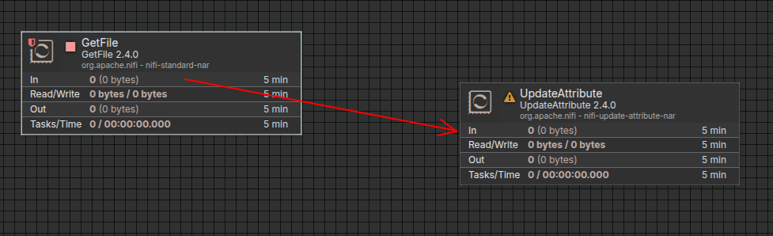

# Proyecto ETL con Apache Nifi

### Objetivo del proyecto
El objetivo principal de este proyecto es demostrar un conocimiento práctico de los componentes y funcionalidades clave de Apache NiFi en el contexto de un pipeline de Extracción, Transformación y Carga (ETL). A través de esta implementación, se busca evidenciar la capacidad de diseñar, construir y operar flujos de datos utilizando esta potente herramienta.

### Requisitos previos del sistema
Java Development Kit (JDK): NiFi requiere Java para funcionar. Es crucial tener la variable de entorno JAVA_HOME configurada correctamente.
* Comprobación de Java para sistemas Unix:
```
java -version
echo $JAVA_HOME
```
* Instalación:
```
sudo apt update
sudo apt install openjdk-11-jdk
```
Para mayor información puedes recurrir a la [documentación oficial.](https://nifi.apache.org/components/)

### Descarga de Apache Nifi
Puedes verificar la versión que deseas descargar [aquí.](https://nifi.apache.org/download/)
* Descarga:
```
wget https://dlcdn.apache.org/nifi/2.4.0/nifi-2.4.0-source-release.zip
```
* Extraer Nifi
```
unzip nifi-2.4.0-source-release.zip
```
* Mover el directorio (recomendado)
```
mv nifi-2.4.0 /opt/
```
### Iniciar interfaz gráfica de Nifi
Se debe navegar al directorio *bin* dentro de la carpeta de NiFi y ejecutar el script de inicio
```
cd /opt/nifi/nifi-2.4.0/bin
```
Dentro de este directorio debes ejecutar:

```./nifi.sh start``` para iniciar nifi

```./nifi.sh stop``` para detener nifi

```./nifi.sh restart``` para reiniciar nifi

### Log in

Puedes acceder a la UI desde [https://localhost:8443/nifi/](https://localhost:8443/nifi/)

Deberías ver algo como esto:


Si encuentras algún problema en este paso debería verificar tu puerto por defecto:
```
nano /opt/nifi/nifi-2.4.0/conf/nifi.properties
```


### Genera tus credenciales
Si bien Nifi genera unas credenciales por defecto, es buena práctica generar un usuario y contraseñas de acceso unico.

Primero debes detener apache Nifi con el comando descrito mas arriba. Luego debes ejecutar lo siguiente dentro del directorio `opt/nifi/nifi-2.4.0/bin/`:
```
./nifi.sh set-single-user-credentials "nuevo_usuario" "nueva_contraseña"
```
La contraseña debe tener 12 caracteres como minimo.

Ahora podemos comenzar nuestro proyecto ETL.

### Construcción de pipeline ETL
* Creación de un grupo de procesos: Es una buena práctica encapsular el flujo en un Grupo de Procesos para modularidad y organización.

Arrastrar el icono de "Process Group" y asignar un nombre, luego click en `Add`. Hacer doble clic para entrar en él.


* Fase de extracción: Se utilizará el procesador **GetFile** para leer archivos del sistema de archivos local. Leeremos el archivo `input/data.csv`.

Arrastrar el icono de "Processor". En el diálogo "Add Processor", buscar y seleccionar GetFile.


Hacer clic derecho en el procesador GetFile y seleccionar "Configure".


En pestaña *"Properties"*: 

Input Directory: Especificar la ruta **a la carpeta** de donde se leera el archivo CSV de entrada.

Keep Source File: Establecer en true si se desea mantener el archivo original.

En pestaña *"Relationships"*: 

Marcar "success" como "Terminate". Hacer clic en "Apply".


* Fase de transformación: Se utilizará el procesador **UpdateAttribute**.

Como ya vimos, arrastra el icono de "Processor". En el diálogo "Add Processor", buscar y seleccionar UpdateAttribute. Crear una conexión entre GetFile -> UpdateAttribute arrastrando la flecha que aparece en GetFile.



Ahora haz clic derecho en el procesador UpdateAttribute y selecciona *configure*.

Vamos a añadir `processing_timestamp`. Este atributo capturará la fecha y hora exacta en que el FlowFile pasa por este procesador. Click en el símbolo `+` y darle un nombre y valor. En **value** vamos a escribir la siguiente Expresión del Lenguaje NiFi (NIFEL):
```
${now():format("yyyy-MM-dd HH:mm:ss")}
```


Ahora vamos a añadir el procesador **ReplaceText**. Repetimos los pasos previos para agregarlo y generar la conexión. Luego vamos a configurarlo.


Asegurate también de configurar correctamente las relaciones.


* Fase de carga: Se utilizará el procesador **PutFile**.
Ahora procedemos a guardar el archivo transformado en un ```CSV```. Para esto, arrastra el procesador **PutFile**.


Configuraciones básicas: En la pestaña **RELATIONSHIPS** asegúrate de que las relaciones Success y Failure estén marcadas para terminate.


Nuestro proceso ETL se ve así desde Apache Nifi:


Y podemos verificar las transformaciones realizadas:


Junto con el timestamp que configuramos:

